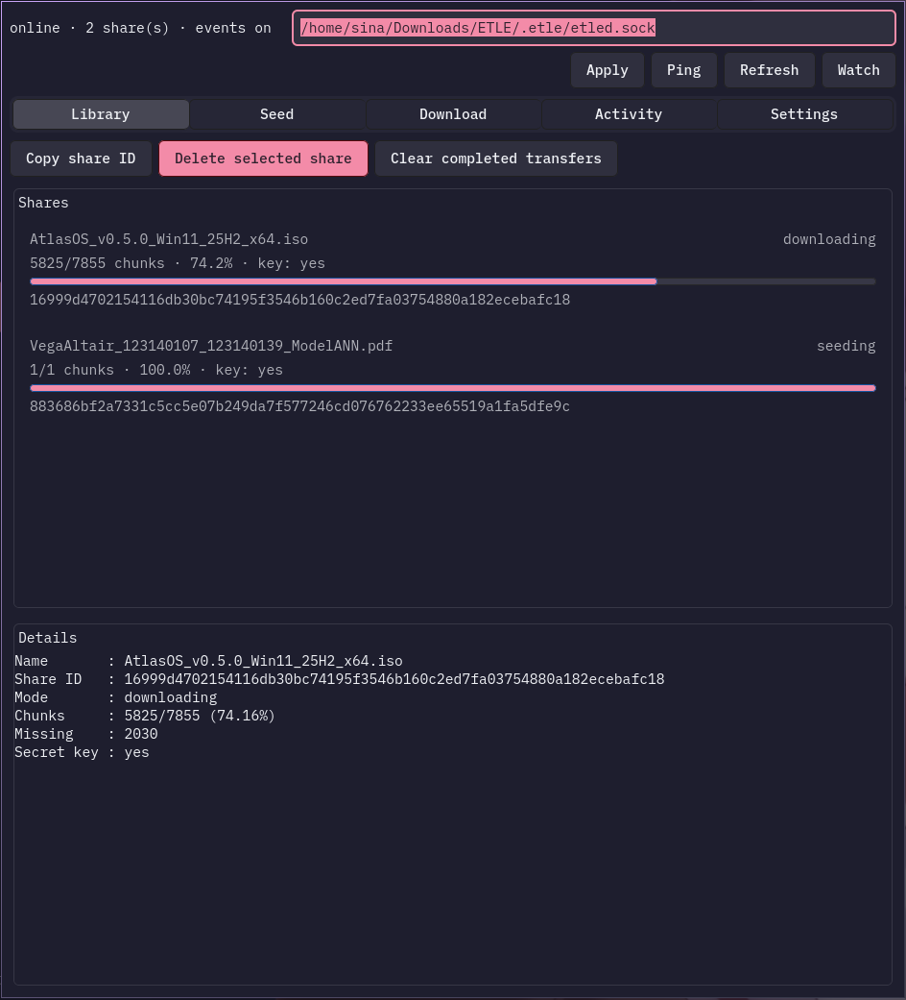
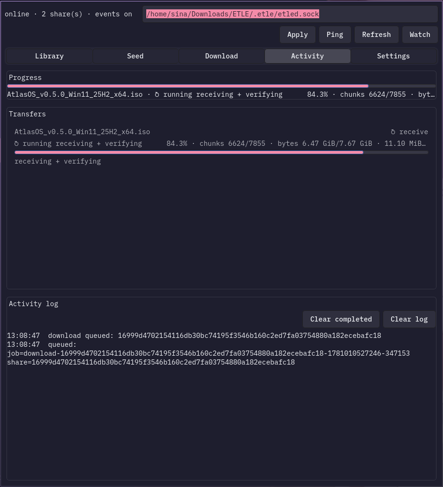
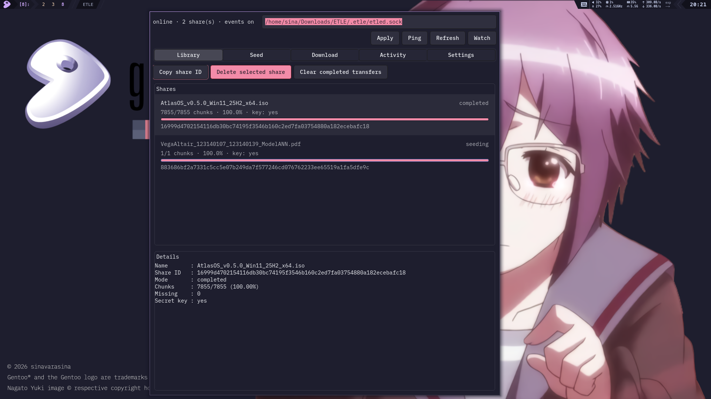
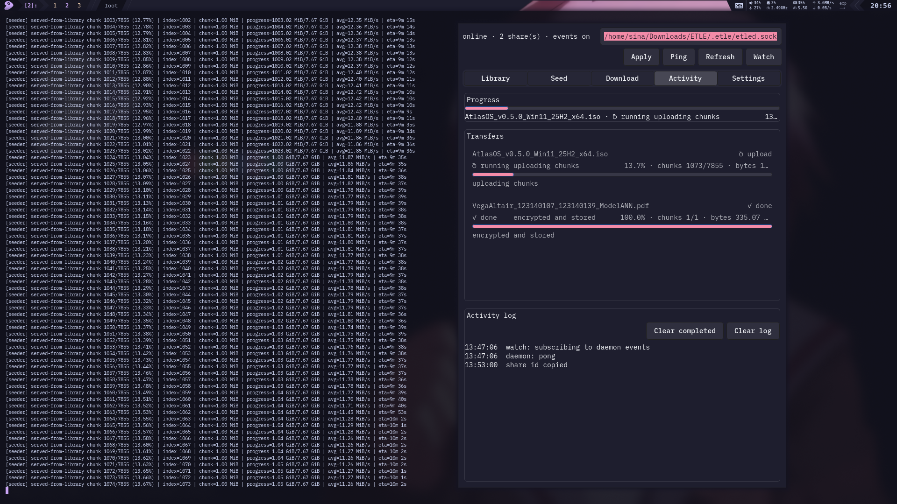
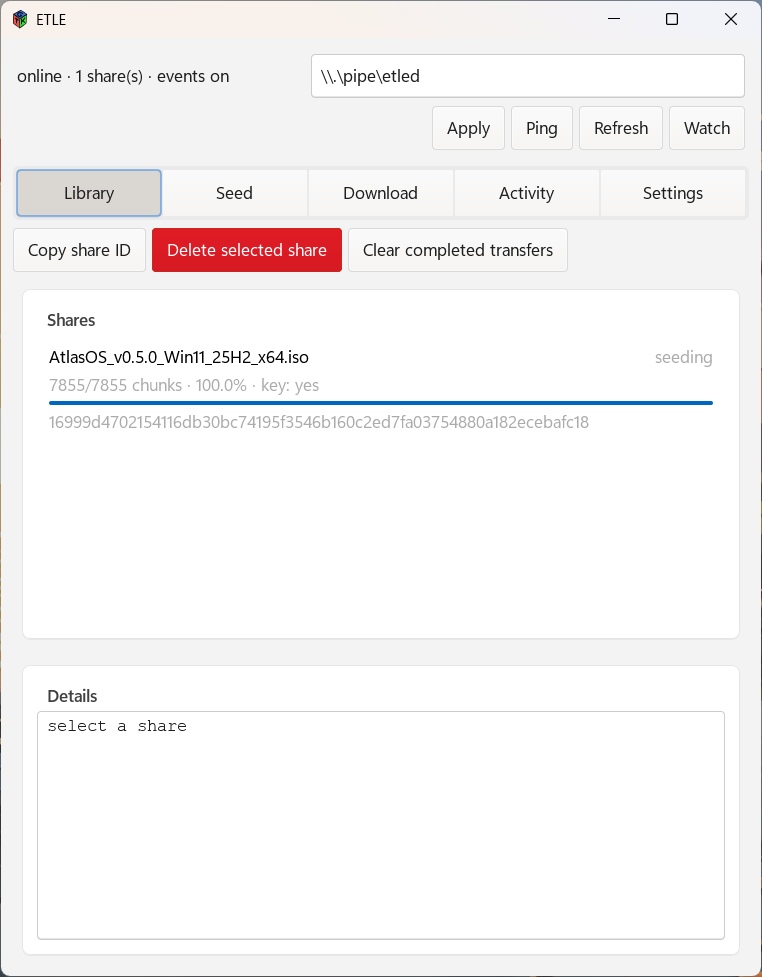
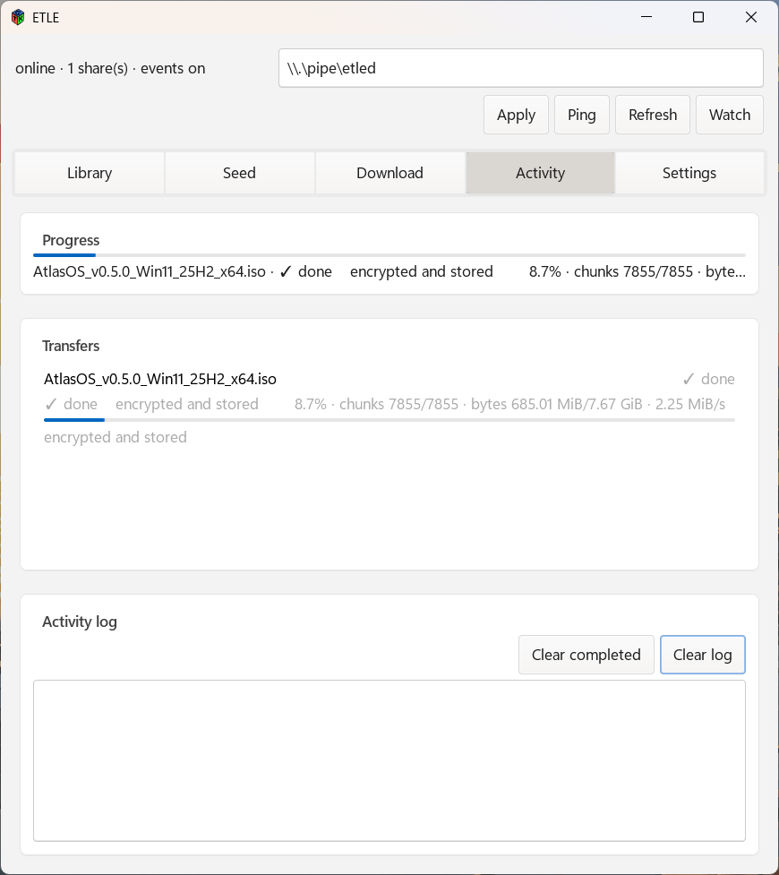
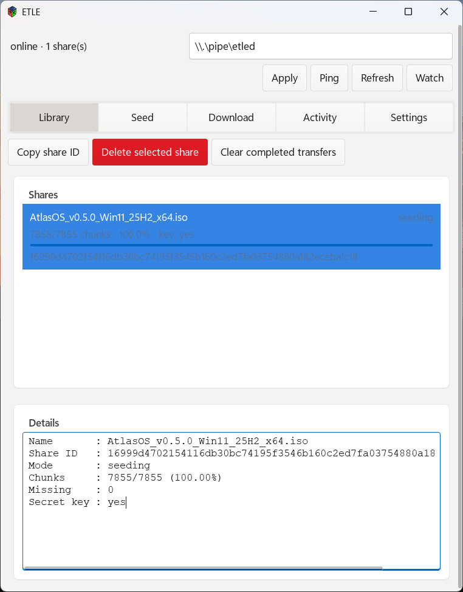
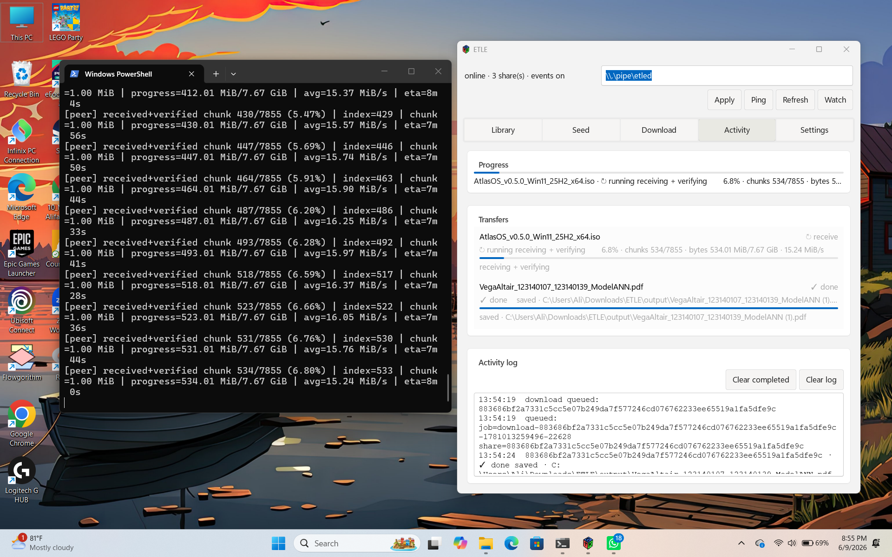

# ETLE
> experimental torrent like w/ encyption

## Disclaimer
this is my college project, i dont have much time to learn & write by myself.  
may i used LLM in some code to speed up the development time.  

## Overview

ETLE is an experimental encrypted P2P file transfer project. The current direction is torrent-like, but ETLE is not BitTorrent-compatible. It uses its own descriptor, chunk format, local library state, IPC daemon, discovery protocol, and GUI.

The project is split into three user-facing binaries:

- `etled` — foreground daemon that owns the local library, listens for P2P connections, serves shares, receives IPC commands, and answers LAN discovery queries.
- `etle-cli` — command-line client for controlling `etled` through IPC.
- `etle-gui` — GTK4/Relm4 GUI for desktop use.

Core ideas:

- Files are split into chunks.
- Chunks are encrypted with XChaCha20-Poly1305.
- Chunk/file/share identity uses BLAKE3.
- Peer sessions use X25519 key exchange.
- Optional PSK authentication can bind the X25519 transcript against active MITM.
- Verified encrypted chunks are stored in a reusable local library.
- A downloaded share can become seedable again when the local library has the needed descriptor, key, and chunks.
- Local library shares can be deleted through the daemon IPC path.

## Download

Prebuilt portable packages are available from the [latest GitHub release](https://github.com/sinavarasina/etle/releases/latest). Use that page if you only want to run ETLE. Build from source when developing or testing unreleased changes.

Release packages include `etle-cli`, `etled`, `etle-gui`, package notes, build information, and checksums.

## Screenshots

### Linux

<p>
  
  
</p>

<details>
<summary>More Linux screenshots</summary>

<p>
  
  
</p>

</details>

### Windows

<p>
  
  
</p>

<details>
<summary>More Windows screenshots</summary>

<p>
  
  
</p>

</details>

## Status

ETLE is still experimental. It is suitable for local development, LAN testing, and college/demo usage. Do not treat it as production-secure software yet.

Implemented or partially implemented:

- Crypto core: BLAKE3, XChaCha20-Poly1305, X25519, PSK auth proof, wrapped file key.
- Protocol: framed `bincode-next` messages, hello, capabilities, key exchange, auth proof, manifest, have map, chunk request/response, error.
- State/library: local share library under an ETLE root directory, including local share deletion.
- Daemon: TCP P2P listener, IPC listener, LAN discovery server, progress/events, and delete/share diagnostics.
- CLI: seed, list, delete, download, fresh download, ping/shutdown/watch daemon, version/build info.
- GUI: GTK4/Relm4 desktop client with library, seed, download, settings, activity, inline delete confirmation, and Windows-specific styling.
- Release packaging: Linux/macOS `.tar.gz`, Windows portable `.zip` with GTK runtime bundle.
- CI/release: fmt, check, test, clippy, GUI build, release artifact packaging, checksums, and security audit workflow.

Still not final:

- Public tracker/DHT is not implemented.
- NAT traversal is not implemented.

## Repository Layout

```text
.
├── Cargo.toml
├── Cargo.lock
├── README.md
├── PLAN.md
├── build.rs
├── docs/
├── examples/
├── benches/
├── src/
│   ├── bin/
│   │   ├── etle-cli.rs
│   │   ├── etled.rs
│   │   └── etle-gui.rs
│   ├── config/
│   ├── crypto/
│   ├── discovery/
│   ├── file/
│   ├── gui/
│   ├── ipc/
│   ├── network/
│   ├── protocol/
│   └── state/
├── tests/
└── .github/workflows/
```

## Build Requirements

Minimum tools:

- Rust stable
- Cargo
- Git
- GTK4 development files for GUI builds

Linux GTK4 examples:

```bash
# Arch
sudo pacman -S gtk4 pkgconf

# Debian/Ubuntu
sudo apt install pkg-config libgtk-4-dev

# Fedora
sudo dnf install gtk4-devel pkgconf-pkg-config

# Gentoo
doas emerge gui-libs/gtk dev-util/pkgconf
```

Windows GUI builds use MSYS2 UCRT64 in CI and release packaging:

```text
mingw-w64-ucrt-x86_64-rust
mingw-w64-ucrt-x86_64-gcc
mingw-w64-ucrt-x86_64-pkgconf
mingw-w64-ucrt-x86_64-gtk4
```

macOS GUI builds use Homebrew:

```bash
brew install gtk4 pkg-config
```

`Cargo.lock` is part of the release input. If `Cargo.toml` changes, regenerate and commit `Cargo.lock` before running CI commands with `--locked`.

## Local Build

Run the same baseline checks used by CI:

```bash
cargo fmt --all -- --check
cargo check --locked --all-targets
cargo test --locked --all-targets
cargo clippy --locked --all-targets --all-features -- -D warnings
```

Check the GUI-only feature set:

```bash
cargo check --locked --no-default-features --features gui-relm4 --bin etle-gui
cargo clippy --locked --no-default-features --features gui-relm4 --bin etle-gui -- -D warnings
```

Build CLI and daemon:

```bash
cargo build --locked --release --bin etle-cli --bin etled
```

Build GUI:

```bash
cargo build --locked --release --no-default-features --features gui-relm4 --bin etle-gui
```

Check build information:

```bash
./target/release/etle-cli --version
./target/release/etled --version
./target/release/etle-gui --version
```

Optional benchmark compile check:

```bash
cargo bench --no-run
```

## Quick Start

Start the daemon:

```bash
./target/release/etled -v serve
```

Seed a file into the daemon library:

```bash
./target/release/etle-cli seed ./sample.bin
```

List local shares:

```bash
./target/release/etle-cli list
```

Delete a local library share:

```bash
./target/release/etle-cli delete --share-id <64_HEX_SHARE_ID>
```

Download using LAN discovery:

```bash
./target/release/etle-cli download \
  --share-id <64_HEX_SHARE_ID>
```

Download using an explicit peer:

```bash
./target/release/etle-cli download \
  --share-id <64_HEX_SHARE_ID> \
  --peer 192.168.1.15:7000
```

Use multiple peers and parallel workers:

```bash
./target/release/etle-cli download \
  --share-id <64_HEX_SHARE_ID> \
  --peer 192.168.1.15:7000 \
  --peer 192.168.1.20:7000 \
  --parallel 4
```

Run the GUI:

```bash
./target/release/etle-gui
```

## Daemon Defaults

Default ports:

```text
P2P TCP:        7000
Discovery UDP: 37037
Multicast:     239.255.0.86
```

Default library root:

```text
Linux/macOS: ~/Downloads/ETLE
Windows:     %USERPROFILE%\Downloads\ETLE
```

The daemon creates an internal `.etle/` directory inside the library root.

## PSK Authentication

Without PSK, X25519 gives an encrypted session but is not MITM-resistant. For better LAN testing, run both sides with the same PSK.

Seeder daemon:

```bash
ETLE_AUTH_PSK="same-password" ./target/release/etled -v serve
```

or:

```bash
./target/release/etled -v serve --auth-psk "same-password"
```

Downloader:

```bash
./target/release/etle-cli download \
  --share-id <64_HEX_SHARE_ID> \
  --peer 192.168.1.15:7000 \
  --auth-psk "same-password"
```

The GUI PSK field applies to download/client commands. A running daemon server PSK must be configured when `etled serve` starts.

## Release Artifacts

Prebuilt packages for normal use are published on the [latest GitHub release](https://github.com/sinavarasina/etle/releases/latest).

Release tags should use semantic version format:

```text
vMAJOR.MINOR.PATCH
```

Example:

```bash
git tag -a v1.0.1 -m "ETLE v1.0.1"
git push origin v1.0.1
```

Expected assets:

```text
etle-v1.0.1-x86_64-unknown-linux-gnu-portable.tar.gz
etle-v1.0.1-aarch64-apple-darwin-portable.tar.gz
etle-v1.0.1-x86_64-pc-windows-gnu-portable.zip
CHECKSUMS.txt
```

Each package contains:

```text
etle-cli / etle-cli.exe
etled / etled.exe
etle-gui / etle-gui.exe
PACKAGE-NOTES.md
BUILD-INFO.txt
SHA256SUMS.txt
README.md
LICENSE*
```

Windows portable packages also bundle the GTK runtime files needed by `etle-gui`.

## Documentation

Detailed documentation lives in `docs/`:

- `docs/architecture.md`
- `docs/code-map.md`
- `docs/algorithms.md`
- `docs/data-formats.md`
- `docs/transfer-flow.md`
- `docs/swarm-and-resume.md`
- `docs/security-model.md`
- `docs/crypto.md`
- `docs/protocol.md`
- `docs/library-state.md`
- `docs/daemon-and-ipc.md`
- `docs/discovery.md`
- `docs/cli.md`
- `docs/gui.md`
- `docs/build-and-release.md`
- `docs/development.md`
- `docs/troubleshooting.md`

## Notes

This project is intentionally small and experimental. The implementation prioritizes learning, clarity, and demo value over protocol stability or compatibility with existing torrent clients.


## License
MIT
